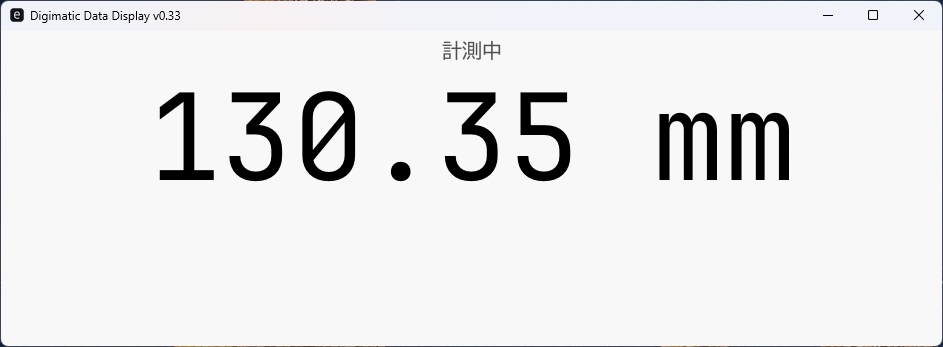

# About This Project
*[日本語はこちら](README.ja.md)*

# Mitutoyo Digital Caliper to PC Interface (SPC)

This tool enables PCs to receive data output from Mitutoyo digital calipers.
The signal from the caliper is captured by a Raspberry Pi Pico (specifically, a Seeed Studio XIAO RP2040) and transmitted to the PC.

**Tech Stack:**
- **PC Side:** Rust
- **Hardware Interface:** MicroPython (XIAO RP2040)

### Data Flow
`Caliper` → `Level Shifter (SN74LXC8T245PWR)` → `XIAO RP2040` → `PC (Linux / Windows)`

---

## Current Status

### 1. CLI Simulator

*Available on Linux/macOS (uses `socat`; not supported on Windows).*

 - Generates simulated caliper measurement data
 - Creates frame strings based on Mitutoyo specifications
 - Uses virtual serial ports for communication
 - Sends and receives data through virtual ports (more realistic than in-memory simulation)
 - Decodes received frames to extract measurement values

### 2. Diagnostic Mode in Pico Firmware
*Diagnostic mode includes:

 - Simple text menu: Use a classic text-based menu
 - Pin status monitoring: View GPIO pin status in real time
 - Device settings: View and change settings (changes are not saved; settings are reset when you exit this mode)
 - Toggle mode: Automatically toggles pin output on and off

  Type Diag in the terminal to enter this mode.

### 2. GUI Display
<a href="./pc_tool/assets/DisplayWindow(windows).png">
  
</a>

- The GUI mode is currently available for **Windows**. (Linux support is TBD).
- **To Launch:** Run with `-gui -sim` flags.
  ```bash
  cargo run --bin digimatic -- -gui -sim

### 3. Hardware Implementation
Communication: Successfully verified on a breadboard.

Assembly: Currently migrating the circuit to a universal board (perfboard).

### 4. Software Progress
  - Pico (MicroPython): Receives bitstreams from the caliper and forwards them to the PC.
  - PC (Rust): Receives string frames and logs them to CSV or displays them in the terminal.

Implementation of the dedicated display window is in progress.

## Software Setup
RP Pico Firmware
Transfer the following files to the Pico. main.py will execute automatically upon reboot:
  - main.py
  - pin_definitions.py
  - led_switch.py
  - state_process.py
  - decoder.py
  - communicator.py
  - diag.py
  - model_caliper.py  (for sim)
  - sim_driven.py  (for sim)
  - i18n.py

### Required Components
Details for the hardware interface (Electronic construction):

  - Connection Cable: Mitutoyo Genuine Flat Straight Cable (905338)
  - Connector: 10-pin Box Header, PCB Mount (e.g., Marutsu 217010SE)
  - Microcontroller: Seeed Studio XIAO RP2040
  - Level Shifter (1.5V -> 3.3V): SN74LXC8T245PWR
  - Adapter Board: TSSOP24 to DIP conversion board (DA-TSSOP24-P65)
  - LDO Regulator: AP2112 (for Level Shifter power supply)

## TODO

[ ] Settings UI: Implement UI in egui to allow users to change font sizes and colors.

[ ] Unit Display: Add units (e.g., "mm") next to the numerical values.