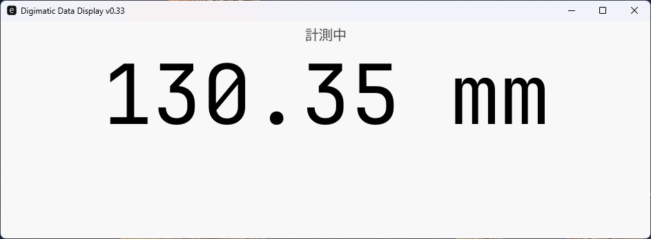

# Mitutoyo Digital Caliper to PC Interface (SPC)

*[日本語はこちら](README.ja.md)*

Capture, decode, and log measurement data from Mitutoyo digital calipers using a Raspberry Pi Pico and Rust-based PC pipeline.

---

## ✨ Overview

This project provides a complete pipeline for receiving Digimatic data from Mitutoyo calipers and processing it on a PC.


<p align="center">
  
</p>


The system has been refactored in **v2.0.0** to clarify architecture boundaries and stabilize the data flow.

- 📡 Capture raw signals via Raspberry Pi Pico (XIAO RP2040)
- 🔄 Decode Digimatic frames into structured measurements
- 💾 Log raw and processed data
- 🧪 Full simulation mode without hardware

---

## 🧭 Architecture (v2)

The system is now explicitly layered:

```text
Sim / Hardware Input
↓
Frame Parser (frame.rs / parser.rs)
↓
Measurement (core domain model)
↓
Presentation / Logger / GUI
```

Key change in v2:
> Measurement is now the unified intermediate representation of all decoded data.

---


## 🎯 Who is this for?

This project is primarily designed for personal and hobby use, but also serves as a practical tool for:

- Logging measurements from digital calipers  
- Experimenting with Digimatic communication protocols  
- Learning embedded ↔ PC data communication  
- Debugging low-level signal handling  

It is especially useful if you want access to both **raw communication data** and **decoded measurement values**.

---

## 🔧 Tech Stack

- **PC Side:** Rust  
- **Hardware Interface:** MicroPython (Raspberry Pi Pico / XIAO RP2040)

---

## 🔁 Data Flow

`Caliper` → `Level Shifter (SN74LXC8T245PWR)` → `XIAO RP2040` → `PC (Linux / Windows)`

Simulation mode replaces the hardware input stage.

---

## 🚀 Features

- Real-time measurement data capture  
- Digimatic frame decoding (v2 stabilized parser)
- CSV logging (raw + processed data) and terminal display  
- CLI simulation mode (no hardware required)
- GUI visualization (egui-based)
- Optional legacy I/O support (isolated)
- Built-in diagnostic mode on Pico  

---

## 🧪 Simulation Mode

The simulator allows full pipeline execution without hardware.

### Generator-based simulation
- Produces realistic caliper-like values (0.01mm – 150mm)
- Converts values into Digimatic frame format
- Feeds the same parser as real hardware

### Pico Simulation Mode
- Generates simulated caliper measurement data  
- Sends Digimatic frames as strings via CDC-USB (virtual serial port)  

### Notes
- No longer uses virtual serial port as default path
- Legacy socat-based pipeline is isolated in `/legacy`

---

### Highlights
- Realistic virtual serial communication (not in-memory)  
- Frame generation based on Mitutoyo specifications  
- Frame decoding and validation  

---

## 🧰 Embedded (Pico) Diagnostic Mode

A built-in interactive diagnostic tool for GPIO and device behavior.

- Text-based menu interface  
- Real-time GPIO monitoring  
- Temporary device configuration  
- Pin toggle testing  

Type `Diag` in the terminal to enter this mode.

> The diagnostic mode is feature-rich enough to function as a standalone debugging tool.

---

## 🖥 GUI Display (Windows)

GUI is available via Rust desktop application (egui-based).

<a href="./pc_tool/assets/DisplayWindow(windows).png">
  
</a>

- Currently available on **Windows** (Linux support TBD)

**Launch:**
```bash
cargo run --bin digimatic -- -gui -sim
```

---

## 📦 Legacy System (v2)

The following components are no longer part of the active pipeline:

- Virtual serial port (`socat`-based transport)
- Direct `SerialPort` sender abstraction

These are preserved in:

```text
/legacy
```

They are retained for reference and possible future OS-level I/O redesign.

---

## 🧭 Design Philosophy (v2)

  - Clear separation of simulation and core parsing logic
  - Measurement as a stable domain model
  - IO layers isolated from domain logic
  - Future extensibility prioritized
  - Binary frame support
  - OS abstraction
  - Alternative transport layers

---

## 🚀 Future Direction (v3+)

  - Binary frame support
  - Trait-based frame generator abstraction
  - Cross-platform virtual port layer redesign
  - Logging / console unification
  - GUI / CLI presentation layer consolidation

---

## ✅ Status

v2.0.0 represents a stabilized architecture milestone.

The system is now:

  - Structurally layered
  - Free of hidden IO dependencies
  - Fully simulation-capable without hardware
  - Ready for future protocol extensions

---

## License

This project is licensed under his choice of either:

* Apache License, Version 2.0 ([LICENSE-APACHE](LICENSE-APACHE) or http://www.apache.org/licenses/LICENSE-2.0)
* MIT license ([LICENSE-MIT](LICENSE-MIT) or http://opensource.org/licenses/MIT)
